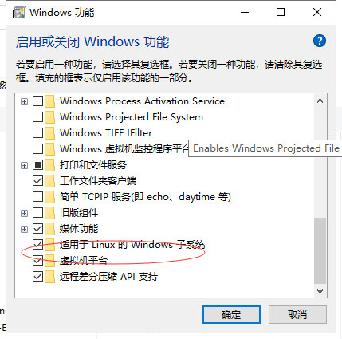
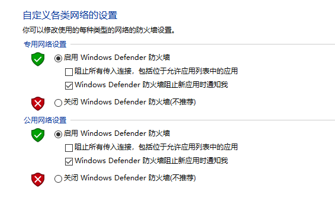
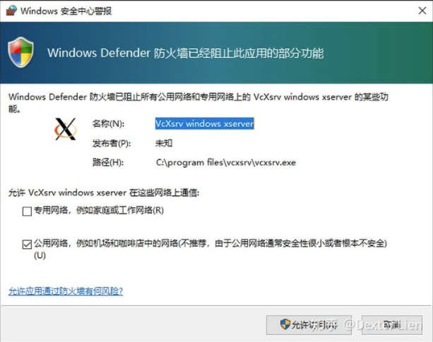
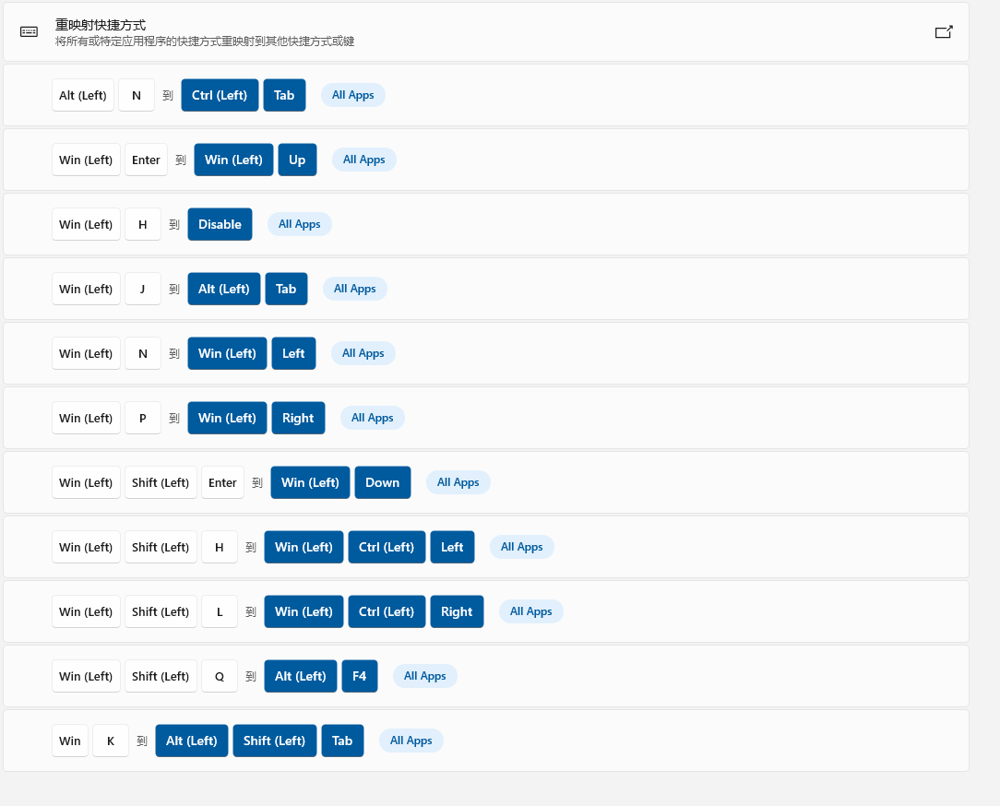

<!-- TOC GFM -->

+ [important](#important)
+ [我的工作环境 `ArchLinux Wsl2` `Total Commander` `VimDestop` `Utools`](#我的工作环境-archlinux-wsl2-total-commander-vimdestop-utools)
	* [winwsl2 安装ArchLinux的方法](#winwsl2-安装archlinux的方法)
	* [第一步：先安装wsl2](#第一步先安装wsl2)
	* [第二步就是安装`ArchLinux` 啦，安装过程还是比较简单，直接下载改个后缀就能安装](#第二步就是安装archlinux-啦安装过程还是比较简单直接下载改个后缀就能安装)
		- [安装`LxRunOffline`](#安装lxrunoffline)
		- [备份和还原](#备份和还原)
			+ [wsl2硬件资源分配](#wsl2硬件资源分配)
	* [wsl2 占用内存过高问题](#wsl2-占用内存过高问题)
		- [WSL2(Arch Linux)使用systemd报错问题](#wsl2arch-linux使用systemd报错问题)
	* [配置Total Commander](#配置total-commander)
	* [开机启动项](#开机启动项)
			+ [跳转目录](#跳转目录)
	* [Utools](#utools)
		- [全局快捷键](#全局快捷键)
	* [改键工具, `Powertoys`](#改键工具-powertoys)

<!-- /TOC -->


# important
很重大的发现,在`windows` 和`vim` 交互时候,一定要在**写入模式** 下粘贴,要不然,粘贴的东西会有差异


# 我的工作环境 `ArchLinux Wsl2` `Total Commander` `VimDestop` `Utools` 
- ArchLinux Wsl2
- Total commander + VimDestop
- Utools
## winwsl2 安装ArchLinux的方法
参考文档1:[wsl安裝archlinux](https://blog.csdn.net/qq_41932665/article/details/108459723) 
参考文档2：[wsl2配置archlinux](https://segmentfault.com/a/1190000038557999?utm_source=sf-related) 
## 第一步：先安装wsl2
`以下代码都是Powshell在管理员权限下运行` 
- [ ] 启用hyperv [官方文档](https://docs.microsoft.com/en-us/virtualization/hyper-v-on-windows/quick-start/enable-hyper-v) 
- [ ] 启用用于linux的子系统
```
Enable-WinowsOptionalFeature -Online -FeatureName VirtualMachinePlatformd
```
`需要系统重启` 
安装官方文档出现找到如下：


 
 

## 第二步就是安装`ArchLinux` 啦，安装过程还是比较简单，直接下载改个后缀就能安装
[GitHub地址](https://github.com/yuk7/ArchWSL/releases/tag/20.4.3.0) 
下载后缀名为`appx` 的文件，下载到你需要安装的ArchLinux的目录，我的目录是`D/Linux` 

- [ ] 将`.appx` 改为`.zip` 解压到当前目录 , 解压文件有个`Arch.exe` 的可执行程序，直接点击这个程序，`arch` 就开始安装了。安装完成再打开`Arch.exe` 就进入了Arch的环境。下面就是给系统装程序了。
  
我一般都用第二种方法来安装.[LxRunOffline](https://blog.csdn.net/Ricardoge/article/details/119684636) 来安装.
  
### 安装`LxRunOffline` 
普通安装:下载解压[LxRunOffline](https://github.com/DDoSolitary/LxRunOffline/releases) , 并设置环境变量
  
这里并没有给出相关参数,你需要`Win` 标志中右键`管理员权限运行Powershell` 输入`LxRunOffline` 
  
下载[ArchLinux](https://mirrors.tuna.tsinghua.edu.cn/archlinux/iso/latest/) 下载最新版本
以`tar.gz` 结尾的文件  

安装ArchLinux到WSL  
eg:
```
LxRunOffline i -n Arch2 -f D:\Arch2\archlinux-bootstrap-2021.12.01-x86_64.tar.gz -d D:\Arch2\ -r root.x86_64
```
command:
```
LxRunOffline i -n <Arch名称> -f <镜像文件位置> -d <安装位置> 
```

安装完成设置这个系统由`Wsl2` 管理:
Command2:
```
wsl --set-vesion <Arch名称> 2
```

eg:
```
Wsl --set-vesion Arch2 2
```

进入系统:  
```
wsl -d Arch2
```
用`Windows` 编辑`/etc/pacman.conf` 
```
cd /etc
explorer.exe .
```
`别忘记后面的.`在文件后最后面加上中国源:
```
[archlinuxcn]
Serve = https://mirrors.tuna.tsinghua.edu.cn/archlinuxcn/$arch
```

然后进入上一级目录`pacman.d` , 编辑里面的mirrolist文件, 将中国的的源取消注释(`选择部分即可` )  
然后回到Arch:
```
pacman -Syu
pacman-ey --init
pacman-key --populate
pacman -S archlinuxcn-keyring
pacman -S base base-devel vim git wget
```

别忘了给当前`root` 用户设置登录密码:
```
passwd
```

然后再新建一个普通用户:
```
addusr -m -G wheel -s <用户名>
```

将文件`/etc/sudoers` 中的`wheel All=(All) All` 那一行取消注释 **可以在Windows下完成操作**  
PS: 这里有个问题需要注意下, 完成之后用普通用户`sudo pacman` 时候会发现没有权限,需要执行下面操作  
```
usermod -aG wheel <用户名>
```
注意要在`root` 用户下运行, 意思就是将`用户` 加入到`wheel` 组里面  
为用户设置密码:
```
passwd <用户名>
```

查看用户ID:
```
id -u <用户名>
```

一般root用户的id为`0` , 只有一个普通用户一般为`1000`   
设置使用普通用户登录`ArchLinux`   
退出Arch:
```
exit
```

在powershell中执行:
```
lxrunoffline su -n <你的arch名字> -v <账户id>
```

到这里就结束了, 下面就是安装自己需要的软件和实现图形界面

### 备份和还原
可以参照这个博客:https://p3terx.com/archives/manage-wsl-with-lxrunoffline.html
其中执行下面命令没反应,我使用另外一条命令执行备份的
+ 备份  
没反应的备份command:
```
lxrunoffline e -n <WSL名称> -f <压缩包路径>.tar.gz
```

有效的备份命令:
```
wsl -export <WSL名称> <压缩包路径>.tar
```
+ 还原
备份无效的还原命令:
```
lxrunoffline i -n <WSL名称> -d <安装路径> -f <压缩包路径>.tar.gz
```

备份有效的还原命令:
```
wsl --import <WSL名称> <安装路径> <压缩包路径>.tar
```

注意我们安装完成之后, windows的字体要和`Arch` 的字体相匹配, 要不然`ranger` `COC` 会有适配的问题  
安装图形界面:
需要先安装图形界面服务这里用`xorg` 
```
sudo pacman -S xorg xorg-service
```
```
sudo pacman -Sy xfce4 xfce4-terminal
```

图形界面可以不安装, 直接就可调用`ArchLinux` 的应用程序生成图形界面  
只要我们安装下面这个软件:
`Xlaunch`: https://sourceforge.net/projects/vcxsrv/  
这里我们需要取消电脑的不提示公用网络:


然后就会出现下面界面:  

 
#### wsl2硬件资源分配
在用户目录`C:\\Users\\<username>` 下创建`.wslconfig` 文件:

```
[wsl2]
#kernel=C:\\temp\\myCustomKernel
memory=4GB # 将WSL 2中的VM内存限制为4 GB
processors=4 #使WSL 2 VM使用两个虚拟处理器
swap=2GB
localhostForwarding=true

```

## wsl2 占用内存过高问题

[参考1](https://my.oschina.net/u/2266306/blog/4680942) 

[参考2](https://zhuanlan.zhihu.com/p/166102340?ivk_sa=1024320u) 

做一个定时任务,每5分钟清理一次
```
yay -S cronie
sudo crontab -e -u root
sudo crontab -e -u dav

```

会用编辑器打开文件, 添加一下内容:
```
*/15 * * * * sync; echo 3 > /proc/sys/vm/drop_caches; touch /root/drop_caches_last_run
```
然后再bash中加入

```
sudo nano ~/.bashrc
[ -z "$(ps -ef | grep cron | grep -v grep)" ] && sudo /etc/init.d/cron start &> /dev/null
```

我用的fish, 将代码中的`$` 替换成`awk` , 编辑`~/.config/fish/config.fish` 

### WSL2(Arch Linux)使用systemd报错问题
[参考这篇](https://blog.csdn.net/weixin_29266749/article/details/116867124) 
选择`.NET Core runtime runtime 5.0` 的安装即可

启动`cronie` 服务
```
#设置开机启动
sudo systemctl enable cronie.service
#立即启动
sudo systemctl start cronie.service
```
在wsl终端上可以通过查看/ root / drop_caches_last_run上次修改日期来检查cron作业是否正在相应地运行：
```
sudo stat -c '%y' /root/drop_caches_last_run
```


## 配置Total Commander
基本开箱即用, 就是加了两个`bat` 文件,一个是用来在工作目录中打开`windows terminal` , 另外一个是在工作目录打开`jupyter lab` 因为是经常要用工具,分别绑定了快捷键`alt` + `w` , `alt` + `j`  
bat写法也很简单
在total Commander 文件中新建一个`usrcmd.ini` 文件:
```
[em_zylbash]
cmd=D:\TotalCMD\zylcyg.bat
param=%P
[em_zyljupyter]
cmd=D:\TotalCMD\jupyter.bat
param=%P

```

bat文件添加内容如下:
```
@echo off
wt cd %1
wsl
```
```
@echo off
cd %1
jupyter lab
```
注意 `wsl` `jupyter lab` 都要加入到系统环境变量中

## 开机启动项

将[工具](https://linuxyu.oss-cn-beijing.aliyuncs.com/TotalCMD.zip) 放在`D` 盘 

在`win` + `r` 打开`cmd` 运行:
```
shell:startup
```

将里面的`vimd.exe` 创建一个快捷键方式,快捷键方式拖入到开机启动项中,开机就可以用`vimdistop` 

还有上面的`Xlaunch` 的快捷方式也加入到开机启动项中


[VimDestop](https://github.com/goreliu/vimdesktop/wiki/TC%E5%BF%AB%E6%8D%B7%E9%94%AE%E5%88%97%E8%A1%A8)  的使用参照:  
#### 跳转目录
| keys              | functions                                             |
| ----------------- | ----------------------------------------------------- |
| `j`               | down                                                  |
| `k`               | up                                                    |
| `h`               | left                                                  |
| `l`               | right/进入目录/打开文件/将压缩文件当前目录打开        |
| `gg`              | up to first document                                  |
| `G`               | down to the last document                             |
| `H`               | go ahead                                              |
| `L`               | back                                                  |
| `n`               | 最近访问目录                                          |
| `tab`             | 切换面板                                              |
| `U`               | 回到根目录                                            |
| `D`               | 回到桌面                                              |
| `T`               | 打开驱动器列表                                        |
| `Ctrl` `f`        | 或pgdn, 下一页                                        |
| `Ctrl` `b`        | 或pgup, 上一页                                        |
| `.`               | 用explorer 打开当前目录                               |
| `,`               | 添加标签(mark)                                        |
| `d`               | 显示标签                                              |
| -------------     | -------------------------------------------------     |
| `Space`           | 选择/取消选择                                         |
| `J`               | 选择/反选文件                                         |
| `K`               | 选择/反选文件                                         |
| `a`               | 全选文件                                              |
| `Ctrl` `a`        | 全选文件                                              |
| `Ctrl` `d`        | 全部取消选择                                          |
| `B`               | 将所有子目录的文件全部显示在当前目录                  |
| `\`               | 选择或反选所有文件                                    |
| `]`               | 选择和光标所在文件相同拓展名的文件                    |
| `shift` `]`       | 取消`]` 的选择                                        |
| `[`               | 选择当前文件                                          |
| `shift` `[`       | 取消选择当前文件                                      |
| ----------------  | ----------------------------------------------------  |
| `Ctrl` `c`        | 复制                                                  |
| `Ctrl` `x`        | 剪切                                                  |
| `Ctrl` `v`        | 粘贴                                                  |
| `f9`              | 同`f5`                                                |
| `f10`             | 同`f6`                                                |
| `x`               | 同`del`                                               |
| `X`               | 同`Shift` `del`                                       |
| `r`               | 重命名                                                |
| `R`               | 打开批量重命名窗口                                    |
| `f2`              | 参考下github                                          |
| `y`               | 复制文件名                                            |
| `Y`               | 复制文件路径                                          |
| `Ctrl` `y`        | 复制选定的所有列                                      |
| `f`               | 提示复制相关操作                                      |
|-------------------|-------------------------------------------------------|
| `q`               | 在对侧预览光标所在文件                                |
| `w`               | 或`f3` , 在新窗口预览选定文件                         |
| `e`               | 编辑光标所在文件, 只有一个notepad                     |
| `shift` `f3`      | 在新窗口预览光标所在文件                              |
| `I`               | 或`Alt`` f3`  使用外部查看编辑器打开文件              |
| `alt` `Enter`     | 查看属性对话框                                        |
| `Ctrl` `g`        | 打开更改属性对话框                                    |
|-------------------|-------------------------------------------------------|
| `;`               | 打开书签, 使用菜单首字母或带下划线字母定位            |
| `;` `c`           | 配置书签 `&` + 字母                                   |
| `;` `r`           | 从书签中删除当前目录                                  |
| `"`               | 默认配置不启用                                        |
| `_`               | 取消标记文件,默认文件不启用                           |
|-------------------|-------------------------------------------------------|
| `b`               | 解压文件, 默认解压到对侧,删除路径解压到本目录         |
| `p`               | 压缩文件,压缩到对侧                                   |
| `Ctrl` `p`        | 压缩文件到当前目录,配置见github                       |
|-------------------|-------------------------------------------------------|
| `C`               | 使用内置工具比较两个选定文件                          |
| `W`               | 使用外置工具比较两个选定文件                          |
| `M`               | 打开内置的"比较两侧目录内容"窗口                      |
| `Ctrl` `m`        | 比较两侧目录内容,并选定不同的文件,                    |
|-------------------|-------------------------------------------------------|
| `o`               | 打开右键菜单                                          |
|-------------------|-------------------------------------------------------|
| `/`               | 搜索模式, 只显示匹配的文件                            |
| `?`               | 打开搜索工具对话框                                    |
| `F`               | 在单独的进程打开搜索对话框                            |
| `O`               | 打开按拓展名过滤文件对话框                            |
|-------------------|-------------------------------------------------------|
| `t`               | 打开新标签页                                          |
| `Ctrl` `t`        | 在新标签页打开光标所在目录                            |
| `u`               | 关闭标签页                                            |
| `f11`             | 或`P` `gT` , 定位到前一个标签页                       |
| `f12`             | `N` 或`gt` , 定位到下一个标签页                       |
| `g+` 数字         | 定位到第几个标签页                                    |
| `g`               | 提示标签页相关内容                                    |
|-------------------|-------------------------------------------------------|
| `zv`              | 切换水平,垂直切分                                     |
| `zz`              | 在水平方向,切换半屏,全屏                              |
| `Ctrl` `u`        | 对调两个窗口内容                                      |
| `=`               | 让对侧内容和这边一致                                  |
| `z`               | 提示更多窗口相关内容                                  |
|-------------------|-------------------------------------------------------|
| `m`               | 切换列表,缩略图模式                                   |
| `jkhl`            | 在缩略图模式中, 变成方向键                            |
| `ctrl` `h`        | 在缩略图模式中 left                                   |
| `ctrl` `l`        | 在缩略图模式中 right                                  |
| `ctrl` `j`        | 在缩略图模式中 down                                   |
| `ctrl` `k`        | 在缩略图模式中 up                                     |
| `v`               | 切换列视图                                            |
| `s`               | 奇幻文件排序方法                                      |
| `ctrl` `s`        | 显示当前目录下所有子目录大小                          |
|-------------------|-------------------------------------------------------|
| `E`               | 当前目录下进入cmd                                     |
| `Ctrl` `e`        | 进入powershell                                        |
| `:`               | 打开下面命令框                                        |
| `Ctrl` `Enter`    | 将光标所在的文件名复制到命令行                        |
|-------------------|-------------------------------------------------------|
| `-`               | 显示或隐藏文件树                                      |
| `Ctrl` `r`        | 刷新                                                  |
| `Q`               | 启用禁用菜单栏                                        |
| `V`               | 界面调整                                              |
| `Z`               | 打开配置窗口                                          |
| `Ctrl` `q`        | 打开内部帮助命令                                      |
|-------------------|-------------------------------------------------------|
| `win` `o`         | 全局, 用tc取代当前文件对话框                          |
| `Ctrl` `Enter`    | 返回光标处文件或目录,用于打开文件                     |
| `Shift` `Enter`   | 返回当前目录并返回, 用于保存文件                      |
| `Enter`           | 如果是目录则进入, 如果是文件则返回                    |
| `1`               | 如果是目录则进入, 如果是文件则打开                    |
## Utools
即装即用, 不要就拆掉
### 全局快捷键
| 快捷键            | 功能     |
|-------------------|----------|
| `alt` `shift` `F` | 翻译     |
| `alt` `shift` `P` | 粘贴板   |
| `alt` `shfit` `B` | bing搜索 |
| `alt` `shift` `J` | 截图     |

## 改键工具, `Powertoys` 
 
| 快捷键                 | 原来快捷键           | 功能               |
|------------------------|----------------------|--------------------|
| `Alt` `n`              | `ctrl` `tab`         | 在单个应用切换标签 |
| `win` `enter`          | `win` `up`           | 切换分屏,全屏      |
| `win` `shift`  `enter` | `win` `down`         | 切换分屏,退出全屏  |
| `win` `h`              | --                   | 怕误按,把他取消    |
| `win` `j`              | `alt` `tab`          | 切换应用           |
| `win` `k`              | `alt` `shift` `tab`  | 反方向切换应用     |
| `win` `n`              | `win` `right`        | 交换当前窗口的位置 |
| `win` `p`              | `win` `left`         | 交换当前窗口的位置 |
| `win` `shift` `h`      | `win` `ctrl` `left`  | 回到上一个虚拟桌面 |
| `win` `shift` `l`      | `win` `ctrl` `right` | 跳到下一个虚拟桌面 |
| `capslk`               | `esc`                | 交换功能           |

